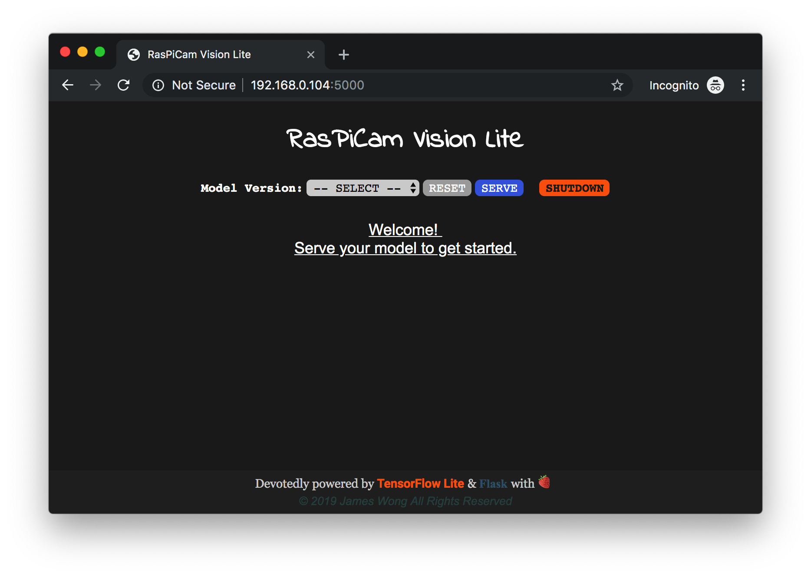

# RasPiCam Vision Lite

This project is a lightweight minimalistic Flask web app that serves on Raspberry Pi and streams live video from its camera module while doing image classification asynchronously with TensorFlow Lite models.

## :strawberry:Overview

## :strawberry:Usage

## :strawberry:How It Works

## :strawberry:Dependencies

## :strawberry:License