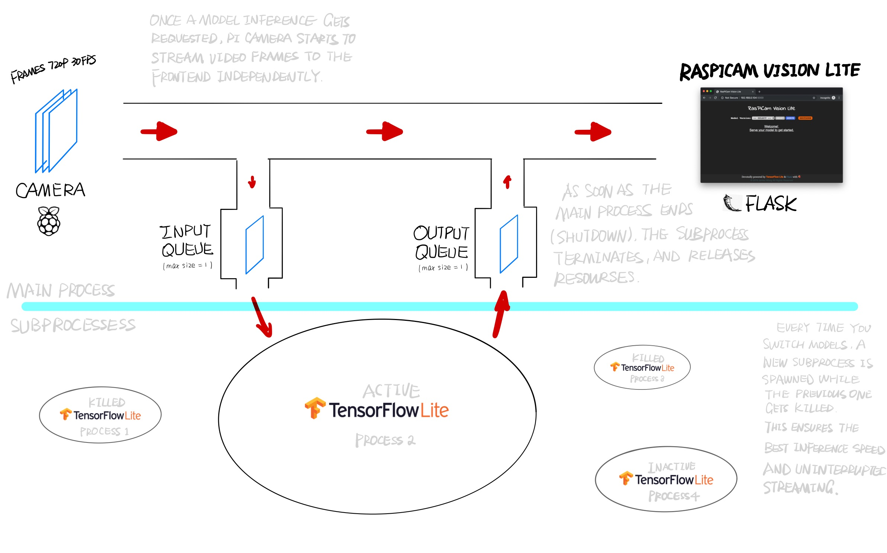

# RasPiCam Vision Lite

RasPiCam Vision Lite is a minimalistic and lightweight [Flask](https://palletsprojects.com/p/flask) web app that serves on [Raspberry Pi](https://www.raspberrypi.org) and streams live video from its camera module at high frame rates while doing on-device image classification asynchronously with [TensorFlow Lite](https://www.tensorflow.org/lite) models. 


## :strawberry:Overview

- RasPiCam Vision Lite allows you to efficiently **serve and switch** over multiple TensorFlow Lite models for image classification with just a few clicks.

- It takes advantage of **concurrency and multiprocessing** and shifts the computational heavy lifting of inference into dedicated subprocesses and threads, independent of video streaming feed, which to a large extent spares you the annoyance of choppy/stuttering frames when they're processed synchronously. 

- You get more things done with a simple, beautiful and flat design. Because why not? *(Click on the preview below for a demo video)*

[](https://www.youtube.com/watch?v=l8zcCfQgHXg)


## :strawberry:Usage

1. Open a terminal, SSH into your Raspberry Pi and clone the repository.

2. *(Optional)* To use models other than the defaults that come with this repository, you can still download and use some other offically released [hosted models](https://www.tensorflow.org/lite/guide/hosted_models#quantized_models) as this project does. Alternatively, train your own custom TensorFlow Lite (optimally [quantized](https://www.tensorflow.org/lite/performance/post_training_quantization)) models either via transfer learning or from scratch, and then place them along with labels inside `models/` simply as the rest of them:

    ```
    .
    └─ models
       └── {your-model-version}
           ├── {your-model-version}.tflite
           └── labels.txt
    ```

3. Start a Flask web server by running `python3 main.py` under the repository root.

4. Open a browser and access the IP address distributed to Raspberry Pi in your local network with default port 5000 (e.g. 192.168.0.104:5000) . You'll be greeted by the web interface as shown above. 

5. Go select one of the models from the dropdown list, and press the **SERVE** button to watch video live streaming as the serving model does inferencing in the background. Try selecting a different model and serve it again. 

6. Shut down the server safely when you're done by clicking **SHUTDOWN**.


## :strawberry:How It Works




## :strawberry:Dependencies

Following setups are fully tested. Some variations could also work, but no guarantee.

**Hardwares**
- Raspberry Pi 3 Model B+
- Pi Camera Module V2

**Softwares**
- Raspbian 9 (stretch)
- Python 3.5+
- TensorFlow 2.0 
- OpenCV 4.1
- Flask 1.1.0
- Picamera 1.13
- Chrome 75, Safari 12

## :strawberry:License

[MIT](https://github.com/jingw222/raspicam_vision_lite/blob/master/LICENSE)